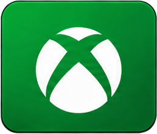
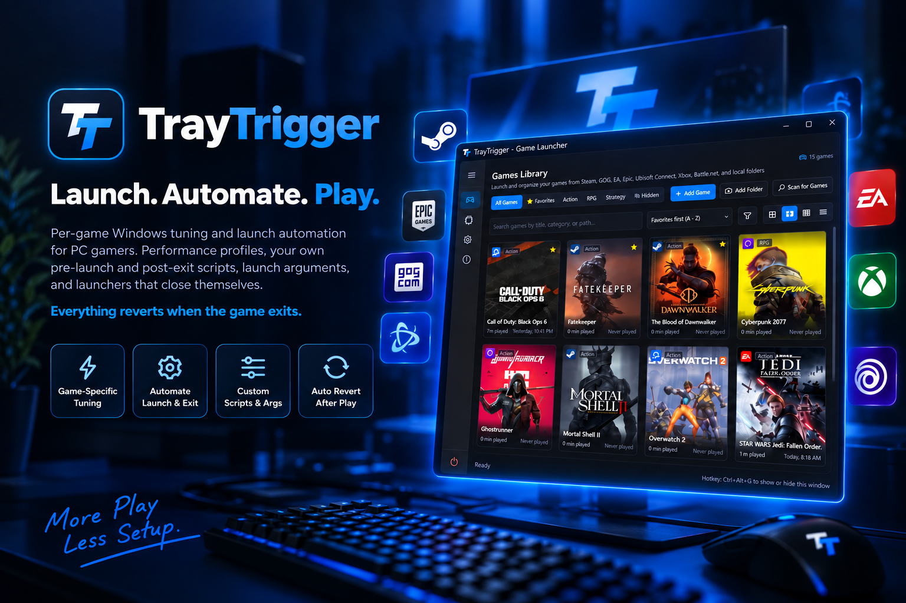
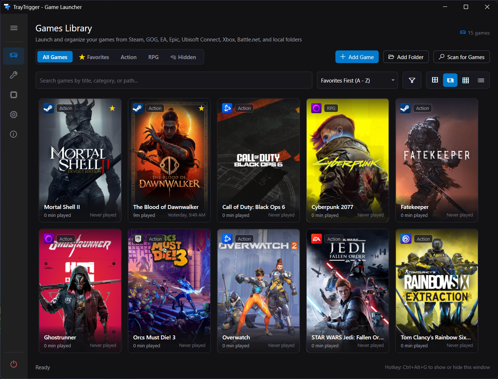
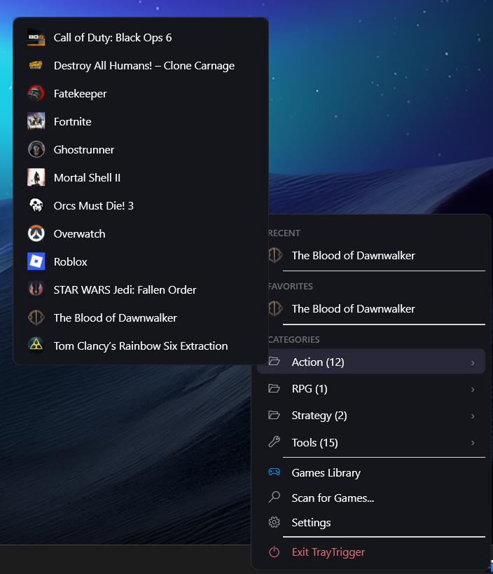

<p align="center">
  
</p>

<h1 align="center">TrayTrigger</h1>

<p align="center">
  
</p>

<p align="center">
  <strong>Your games. Your settings. One tray menu.</strong><br>
  Launch PC games from your Windows system tray and automate your before-and-after routine.<br>
  Optional per-game profile settings restore when you finish. Free and open source.
</p>

<p align="center">
  
  
  
  
  
</p>

<p align="center">
  <a href="https://github.com/stephenh678/TrayTrigger/releases/latest"><strong>⬇ Download for Windows</strong></a>
  &nbsp;·&nbsp;
  <a href="https://github.com/stephenh678/TrayTrigger/releases/latest">Portable ZIP</a>
  &nbsp;·&nbsp;
  <a href="https://stephenh678.github.io/TrayTrigger/">Website</a>
  &nbsp;·&nbsp;
  <a href="https://github.com/stephenh678/TrayTrigger/wiki">Wiki</a>
  &nbsp;·&nbsp;
  <a href="#faq">FAQ</a>
  &nbsp;·&nbsp;
  <a href="https://github.com/stephenh678/TrayTrigger/discussions">Discussions</a>
</p>

<p align="center">
  Windows 10/11 &nbsp;·&nbsp; Free &nbsp;·&nbsp; Open Source (MIT) &nbsp;·&nbsp; No account &nbsp;·&nbsp; No telemetry
</p>

<p align="center">
  &nbsp;&nbsp;
  &nbsp;&nbsp;
  &nbsp;&nbsp;
  &nbsp;&nbsp;
  &nbsp;&nbsp;
  &nbsp;&nbsp;
  &nbsp;&nbsp;
  
  <br>
  <sub>Scans all seven, plus anything you drop on the window. <a href="https://github.com/stephenh678/TrayTrigger/discussions/6">Vote on which launcher comes next.</a></sub>
</p>

---

## Quick start

1. **Download** the installer or portable ZIP from the [latest release](https://github.com/stephenh678/TrayTrigger/releases/latest). Windows 10/11, 64-bit; no separate .NET install needed. See [signing status](#code-signing) and [download verification](#verifying-a-download).
2. **Scan** with **Scan for Games** in the library. Add an executable or shortcut for anything the scan misses.
3. **Launch** a game from TrayTrigger's right-click system-tray menu. Leave its performance profile **Off** to launch without per-game tweaks.

[See the screenshot walkthrough](https://stephenh678.github.io/TrayTrigger/#walkthrough) · [Give feedback](https://github.com/stephenh678/TrayTrigger/discussions) · [Report a bug](https://github.com/stephenh678/TrayTrigger/issues/new/choose)

**Did your first game launch successfully?** Tell us the game and launcher, and what you would like to automate next.


<p align="center">
  
</p>

<!-- HERO GIF: Assets/screenshots/tweaks-apply-revert.gif goes here once recorded. -->

---

## From launch to exit, handled

A launcher's job ends when the game is running. TrayTrigger is what happens around that: what Windows looks like while you play, what your other apps do, and what gets put back when you're done. Per-game profiles restore their settings on exit. System-wide tweaks stay applied until you revert them; custom scripts need their own cleanup actions.

| When | What TrayTrigger does |
|---|---|
| **Before launch** | Snapshots your current settings. Applies the game's **Performance Profile**: power plan, GPU preference, HDR, Do Not Disturb, process priority, timer resolution, CPU cores. Runs your **pre-launch script**: pause Wallpaper Engine, start the OBS replay buffer, close Discord, back up saves. |
| **On launch** | Starts the game with your **launch arguments**, as Administrator if you asked, through its own launcher (Steam, GOG, Epic, EA, Ubisoft, Xbox, Battle.net) or directly. Steam, GOG Galaxy and Epic start quietly in the background, so only the game appears. |
| **While playing** | Stays a tray icon. A launch from a hotkey or the tray menu shows a small card by the clock with what the game is waiting on (Battle.net signing in, say) until it starts. The tooltip and the tray menu's *Now Playing* section show what's running. |
| **On exit** | Restores **per-game profile settings to their previous state**. Runs your **post-exit script**. Closes the launcher if you told it to. Crash-safe: if TrayTrigger or Windows dies mid-game, the snapshot is restored on next start. |

### Why not just Steam?

Steam launches Steam games. It doesn't change your power plan for one game and put it back after, pause your wallpaper, start your replay buffer, or close itself when the game exits. TrayTrigger does that for every game from every store, and it launches Steam games through Steam. It isn't a replacement for any store or launcher; it's the layer under them.

---

<p align="center">
  
</p>

## Launch

Every game from every store in one library, started through its own launcher the way you want it.

### Your Library

The launcher part, so the session part has something to run. A dark, Fluent-style interface built to look at home on Windows 11: poster art, rounded cards, Segoe Fluent icons, no menu bar and no ribbon.

- **Steam, GOG, EA, Epic, Ubisoft Connect, Xbox / PC Game Pass, and Battle.net**: Scan for Games reads each launcher's own install records, so every installed game shows up with its real title and launches through its own client (or, for Game Pass titles, through Windows itself). Each integration has its own on/off switch.
- **Artwork and metadata**: Steam's official metadata (description, developer, release date, Metacritic score) plus high-res poster art from SteamGridDB. Optional RAWG info for games that aren't on Steam (Game Pass, Epic exclusives, Battle.net games like Hearthstone and StarCraft II), with a per-game Steam | RAWG switch. Both need your own free API key and are off until you add one.
- **Three views**: poster grid, large icons, detailed list. Poster cards zoom on hover.
- **Filters**: by launcher, performance profile, and state (never played, favorite, missing executable, has a hotkey, has scripts, runs elevated).
- **Favorites and categories**: favorites pin to the top of the tray menu; the rest goes into custom categories or a flat list.
- **Batch editing**: Ctrl+click, Shift+click, or Ctrl+A, then right-click to favorite, hide, re-categorize, set the Performance Profile, CPU Cores, or launch options, refresh art, or remove, with undo.
- **Drag and drop** an executable or shortcut onto the window to add it. **Batch folder scanner** with executable scoring that filters out uninstallers and launcher stubs. **Icon extraction** from executables, shortcuts, and game folders.
- **Search Settings, System & Performance, and About** from a box beside their tabs: the cards that mention your words stay, with the words highlighted.

<p align="center">
  <br>
  <em>Poster grid with automatic art, categories, filters, and launcher badges</em>
</p>

<p align="center">
  <br>
  <em>Your next game, one tray menu away.</em>
</p>

### Launcher Control

- **Launch arguments** per game, passed exactly as typed.
- **Run as Administrator** per game.
- **Close the launcher after the game exits**: Steam, GOG Galaxy, EA App, Epic, Ubisoft Connect, the Xbox app, or Battle.net shut down once the session ends, so they don't stay resident with their overlays and background processes.
- **Launchers stay minimized** (on by default): Steam and GOG Galaxy start in the background when they aren't already running, and Epic launches silently, so only the game shows.
- **Launch popup** by the tray clock for hotkey and tray launches: the game, what it's waiting on, and the reason if a launch fails, without opening the window.
- **Global hotkeys** to open the library (Ctrl+Alt+G) and the tray menu (Ctrl+Alt+T), both changeable in Settings, and per-game hotkeys to launch.
- **One-click launch from the tray menu**: Recent, Favorites, and Categories, no window to open.

### Tools

Optional, off by default: launch the apps you use alongside games, like DLSS Swapper or MSI Afterburner, from the same tray menu and hotkeys. Drop a program, script, shortcut, or Microsoft Store app on the Tools page to add it.

---

<p align="center">
  
</p>

## Automate

What happens around every launch, set once per game and undone when it exits.

### Performance Profiles

Assign each game a tier in Edit Game. It applies the moment the game launches and reverts the moment it closes.

| Tier | What it does |
|---|---|
| **Off** | No per-game tweaks. TrayTrigger just launches the game. |
| **Optimized** | Your custom high-performance power plan and high-performance GPU preference for that game. Opt-in extras: Enable HDR, Do Not Disturb, Unmute Speakers. |
| **Aggressive** | Everything in Optimized, plus System Responsiveness, MMCSS "Games" scheduling priority, Above Normal process priority, a 0.5 ms timer resolution request, and an off-by-default Microsoft Defender exclusion. |

- **CPU Cores**: independently of the tier, pin any game to the performance cores of a hybrid CPU, for older engines and anti-cheat titles that stutter on E-cores.
- **Session-scoped**: tweaks apply on launch (through any supported launcher or a direct `.exe`) and revert to your exact prior settings on exit. No manual undo, no config left behind.
- **Crash-safe**: the snapshot lives on disk. If TrayTrigger or your PC crashes mid-session, the next start restores your pre-game state. A normal shutdown restores the power plan, HDR, and GPU preference immediately.
- **Two games at once**: machine-wide tweaks apply with the first game and restore with the last. Per-game tweaks apply and restore independently.
- **End Session / Force Close** in the game's right-click menu if a launcher ever stalls. A game that never appears is rolled back automatically after three minutes.

### Pre-Launch and Post-Exit Scripts

Attach a `.bat`, `.cmd`, `.ps1`, or `.exe` to any game. It runs just before the game starts and again after it exits, for direct, Steam, GOG, EA, Epic, Ubisoft, Xbox, and Battle.net launches alike. Use it for anything TrayTrigger doesn't do itself.

**Five real ones ship with the app**, written to be read, copied, and changed:

| Script | What it does |
|---|---|
| `Example-WallpaperEnginePause.ps1` | Pauses and mutes Wallpaper Engine while you play, resumes it after. |
| `Example-QuietMode.ps1` | Closes the background apps you name (OneDrive, Teams, Dropbox) and reopens the ones it closed. |
| `Example-CompanionApps.ps1` | Starts the tools a game needs (SimHub, TrackIR) and closes only the ones it started. |
| `Example-OBSReplayBuffer.ps1` | Runs OBS in the tray with the replay buffer on, so a hotkey saves the last minutes of play. |
| `Example-SaveBackup.ps1` | Zips a save folder before and after you play, keeps the newest ten. |

A script doesn't have to be long. This is a complete pre-launch script:

```bat
@echo off
taskkill /im Discord.exe /f
```

**What you get:**
- **Test Run buttons** next to every script field: runs it now, shows the exit code and output, without launching the game.
- **Script Arguments** per game, so one generic script serves your whole library (a save folder, a profile name, a list of apps).
- **Game info passed in**: phase, game name, exe, game ID, and playtime as arguments, plus `TRAYTRIGGER_*` environment variables.
- **Wait / timeout / cancel-on-failure**: hold the launch until the script finishes, or treat it as a precondition and abort the launch (and roll back the profile) if it fails.
- **Hidden or elevated**: suppress the console window with output captured to the log, or run through UAC.
- **Default scripts** in Settings run for every game that has no script of its own, with a per-game opt-out.
- **New script...** creates a blank template with every argument already read for you and opens it in your editor.

Scripts are off by default. Nothing runs until you enable them and choose one. See the [scripts wiki page](https://github.com/stephenh678/TrayTrigger/wiki/Pre-Launch-and-Post-Exit-Scripts) for the full contract. Community-contributed scripts live in [TrayTrigger-Scripts](https://github.com/stephenh678/TrayTrigger-Scripts), reviewed before listing.

---

<p align="center">
  
</p>

## Play

Windows set up for games, and an eye on the hardware running them.

### Performance Tweaks

System-wide settings, separate from the per-game profiles. 20 documented Windows gaming tweaks plus a Core Isolation status readout, each tweak toggled individually, each showing Windows' **real current state** before you touch anything (HAGS is read from the display driver itself), and each reverting to the exact state TrayTrigger found, not a hard-coded "default". Every tweak has an in-app **Learn more** (and a [wiki page](https://github.com/stephenh678/TrayTrigger/wiki)) that explains the trade-off honestly. Most aren't a guaranteed win for every game, and they're presented that way. Tweaks that can't apply on your machine say so instead of pretending.

<!-- GIF: Assets/screenshots/tweaks-apply-revert.gif (Apply Performance Preset → badges flip → Restore Previous Settings) -->

See [How Performance Tweaks work](https://github.com/stephenh678/TrayTrigger/wiki/How-Performance-Tweaks-work) for the full list, trade-offs, and restore behavior. Revert system-wide tweaks individually or with **Reset Defaults**. Bulk changes can create a System Restore point.

### Hardware Monitoring

Instant breakdown of CPU, GPU, VRAM, RAM, displays, motherboard, BIOS, OS version, and DirectX capability, so you can sanity-check specs before deciding which profile a game gets.

<p align="center">
  
</p>

---

## Installation

### Installer (recommended)
Download `TrayTrigger-v*-Setup.exe` from the [latest release](https://github.com/stephenh678/TrayTrigger/releases/latest) and run it. Installs per-user, no admin needed. No .NET runtime install required; TrayTrigger ships self-contained.

### Portable
Download the portable `.zip` from the [latest release](https://github.com/stephenh678/TrayTrigger/releases/latest), extract it anywhere, and run `TrayTrigger.exe`. No installation, no registry footprint beyond what you explicitly enable in Settings.

### Updates
TrayTrigger checks GitHub Releases for updates and installs them in one click. Enable *Receive pre-release (beta) updates* in Settings to get beta builds first; leave it off for stable releases only.

Every release ships a `SHA256SUMS.txt`. The in-app updater verifies the installer against it before launching, and refuses to install anything that doesn't match.

### Verifying a download
```powershell
Get-FileHash .\TrayTrigger-v1.4.5-Setup.exe -Algorithm SHA256
```
Compare the hash with the matching line in the release's `SHA256SUMS.txt`. Releases are not code-signed (see [Code signing](#code-signing)), so the checksum is how you confirm a download is the file the release workflow built.

From 1.4.5, `SHA256SUMS.txt` is itself signed by the release workflow, and each release includes `SHA256SUMS.txt.sig`. The in-app updater checks that signature against public keys built into TrayTrigger and refuses an update without a valid one, so replacing both the installer and its checksum on a release is not enough to get an update installed. To check it yourself, download both files and [`release-signing-key.pub.pem`](release-signing-key.pub.pem) from this repository, then run (OpenSSL ships with Git for Windows):
```powershell
openssl dgst -sha256 -verify release-signing-key.pub.pem -signature SHA256SUMS.txt.sig SHA256SUMS.txt
```
`Verified OK` means the checksums came from the release workflow. A release signed with the offline backup key verifies against [`release-signing-backup-key.pub.pem`](release-signing-backup-key.pub.pem) instead.

### Requirements
- Windows 10 (version 1809+) or Windows 11, 64-bit
- No separate .NET install needed

---

## FAQ

**Why do I need this if I already have Steam?**
Steam's job ends when the game is running. TrayTrigger handles what happens around that, for every game from every store, and it still launches Steam games through Steam. See [Why not just Steam?](#why-not-just-steam) above.

**Does it work alongside other launchers and library apps?**
Yes. TrayTrigger launches each game through its own client and changes nothing about how those clients work. Run whatever front end you like; TrayTrigger manages the session around the launch.

**Is it safe? What does it touch?**
Only the profiles, tweaks, and scripts you enable. Per-game profile settings restore on exit; system-wide tweaks stay applied until reverted. Scripts require their own cleanup actions. Bulk changes can create a System Restore point first. Scripts are off until you enable them and choose one, and they run as you. See [SECURITY.md](SECURITY.md) for the full breakdown.

**Does it need administrator access?**
Not to run. A few tweaks write machine-wide settings (`HKEY_LOCAL_MACHINE`, the Defender exclusion list) and show a UAC prompt when you enable them. TrayTrigger never runs elevated by default.

**Does it phone home?**
No telemetry. Outbound calls are Steam's public API (metadata and artwork for games you add), SteamGridDB and RAWG (only if you enter your own key), and GitHub Releases (update checks, which you can turn off).

**Can changes be reverted?**
Per-game profile settings restore on exit, with recovery on the next start after a crash. System-wide tweaks can be reverted individually or with Restore Previous Settings. Custom scripts are not automatically undone; configure a post-exit script for any cleanup they need.

---

## Wiki

Every tweak, profile option, script feature, and library setting has a page at the [TrayTrigger wiki](https://github.com/stephenh678/TrayTrigger/wiki). It's the same text the app shows under **Learn more**, generated from the same source files, so it's always current.

## Tech Stack

- **Framework**: .NET 10.0 (WPF) with C# 14
- **Tray Icon**: `H.NotifyIcon.Wpf`
- **WMI & Hardware**: `System.Management`
- **Serialization**: `System.Text.Json` Source Generation (`AppJsonContext`)
- **Native Interop**: Modern `[LibraryImport]` P/Invoke (User32, DwmApi)

## Building From Source

### Prerequisites
- Windows 10 (version 1809+) or Windows 11 (64-bit recommended)
- [.NET 10.0 SDK](https://dotnet.microsoft.com/download)

### Build & Run
```bash
git clone https://github.com/stephenh678/TrayTrigger.git
cd TrayTrigger
dotnet build
dotnet run
```

### Self-Contained Single-File Release
```bash
dotnet publish -c Release -r win-x64 --self-contained true
```

See [CONTRIBUTING.md](CONTRIBUTING.md) for running tests and PR guidelines.

## Contributing

Bug reports, feature requests, and pull requests are welcome. See [CONTRIBUTING.md](CONTRIBUTING.md) to get started. Written a launch script worth sharing? Post it in [Show and tell](https://github.com/stephenh678/TrayTrigger/discussions/categories/show-and-tell).

## Security

If you find a security issue, please see [SECURITY.md](SECURITY.md) for how to report it privately.

## Code signing

> **Status:** releases are **not code-signed**. Verify a download against `SHA256SUMS.txt` as described under [Verifying a download](#verifying-a-download).

Because the installer has no publisher certificate, Windows SmartScreen may show "Windows protected your PC" the first time you run it. Check the file's hash first, then choose **More info** > **Run anyway**. The portable ZIP is the same program without an installer.

**How releases are built.** Release binaries are built exclusively by the public GitHub Actions workflow in [`.github/workflows/release.yml`](.github/workflows/release.yml) on GitHub-hosted runners; nothing is built on a developer machine. Each release publishes `TrayTrigger-v*-Setup.exe`, the portable `.zip`, a `SHA256SUMS.txt` covering both, and a signature of that file, `SHA256SUMS.txt.sig`. The in-app updater refuses an installer that doesn't match, or a checksum file that isn't signed by a TrayTrigger release key.

**Privacy policy.** TrayTrigger collects no telemetry and transfers no personal data. Its only network calls are to Steam's public APIs (game metadata and artwork for games you add), SteamGridDB (artwork, only if you enter your own API key), RAWG (game info for non-Steam titles, only if you enter your own API key), and GitHub Releases (update checks, which can be turned off in Settings). See [SECURITY.md](SECURITY.md) for the full statement.

## Star History

If TrayTrigger saved you a click, an alt-tab, or a settings hunt, a star helps other people find it.

<p align="center">
  <a href="https://star-history.com/#stephenh678/TrayTrigger&Date">
    <picture>
      <source media="(prefers-color-scheme: dark)" srcset="https://api.star-history.com/svg?repos=stephenh678/TrayTrigger&type=Date&theme=dark">
      
    </picture>
  </a>
</p>

## License

This project is licensed under the MIT License - see the [LICENSE](LICENSE) file for details.
