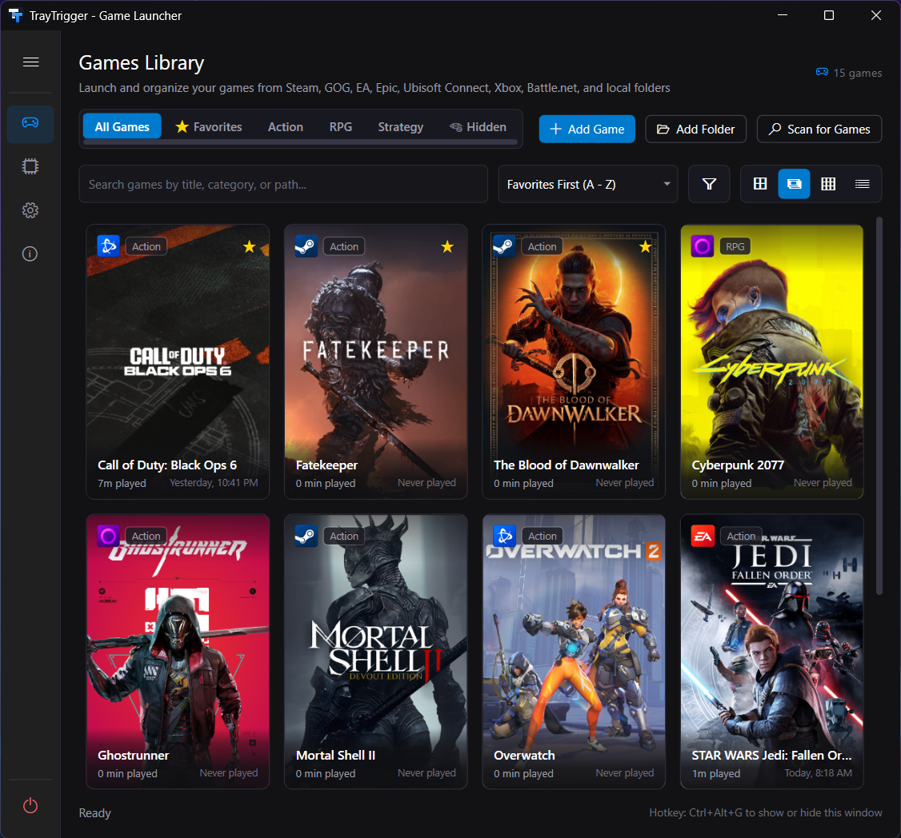
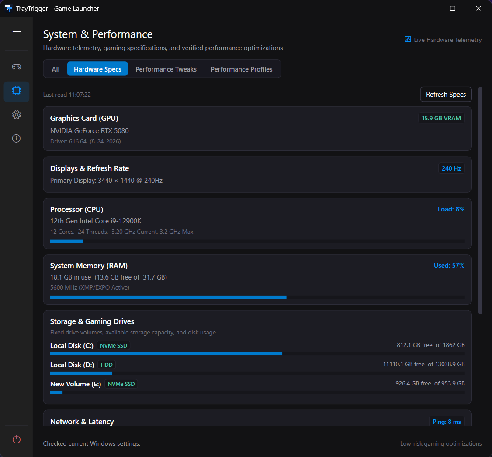
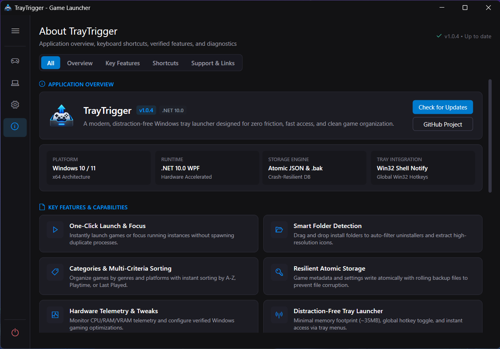

<p align="center">
  
</p>

<h1 align="center">TrayTrigger</h1>

<p align="center">
  <strong>A modern, ultra-fast system tray game launcher and performance companion for Windows.</strong>
</p>

<p align="center">
  
  
  
  
</p>

---

## Overview

**TrayTrigger** is a lightweight, high-performance Windows desktop application designed to streamline how you launch, organize, and optimize PC games. Inspired by modern Windows 11 Fluent design and Steam jump lists, TrayTrigger lives quietly in your system notification tray while giving you instant 1-click access to your library, system specs, and gaming tweaks.

---

## Screenshots

<p align="center">
  <br>
  <em>Poster grid library view with automatic art, categories, and Steam integration</em>
</p>

<p align="center">
  <br>
  <em>Live hardware telemetry: GPU, display, CPU load, RAM, and storage</em>
</p>

<p align="center">
  <br>
  <em>In-app overview of key features, shortcuts, and diagnostics</em>
</p>

---

## Key Features

### 🎮 Modern System Tray Jump List
- **1-Click Launch**: Launch your favorite and recently played games directly from the system tray context menu without opening the full UI.
- **Dedicated Recent Section**: Directly accessible at the top of the tray menu with high-resolution 24x24 icons.
- **Category Organization**: Keep games structured in folders (Action, RPG, Strategy, Steam, etc.) or view as a flat list.
- **Steam & Windows 11 Aesthetics**: Dark slate elevated surfaces, smooth rounded selection highlights, and drop shadows.

### 📚 Comprehensive Game Library
- **Multiple Layout Views**: Grid view (vertical poster cards), Large Icons view, and Detailed List view.
- **Automatic Metadata & Art**: Integrates with Steam APIs and SteamGridDB to fetch official high-res poster art, descriptions, developers, release dates, and Metacritic scores.
- **Automated Icon Extraction**: Extracts crisp 32-bit icons directly from executables, shortcuts (`.lnk`), and game folders with procedural fallback badge generation.
- **Drag & Drop Importing**: Simply drag executables or shortcuts onto the window to automatically add games to your library.
- **Batch Folder Scanner**: Scan entire game drives or directories with intelligent executable scoring to filter out uninstaller and launcher binaries.
- **Favorites & Categories**: Pin favorite games to the top of the tray menu and library, and organize the rest into custom categories.

### 🎯 Game-Level Performance Profiles
- **Per-Game Optimized / Aggressive Profiles**: Assign each game its own tweak tier from Edit Game. Optimized applies your custom high-performance power plan and GPU preference; Aggressive layers on System Responsiveness, MMCSS "Games" scheduling priority, Above Normal process priority, and an off-by-default Windows Defender exclusion.
- **Session-Scoped, Zero Manual Cleanup**: Tweaks apply the moment a game launches (Steam or direct `.exe`) and revert to your exact prior settings the moment it closes - nothing is ever assumed back to a generic default.
- **Crash-Safe**: If TrayTrigger or your PC crashes mid-session, the next launch detects and restores your pre-game state automatically.

### ⚡ Verified System-Wide Performance Tweaks
- **Live Hardware Telemetry**: Instant breakdown of CPU, GPU, VRAM, RAM, Displays, Motherboard, BIOS, OS version, and DirectX capability.
- **15 Verified Windows Tweaks** across Input & Display, CPU & Scheduling, Network & Background, and Security & Advanced - each grounded in Microsoft documentation rather than folklore: mouse acceleration, Hardware-Accelerated GPU Scheduling (HAGS), Game Mode, System Timer Resolution, MMCSS network throttling, Delivery Optimization, Game DVR, Xbox Game Bar, telemetry, and more.
- **Opt-In Tweaks**: Situational or tradeoff-heavy tweaks (Windows Visual Effects, Disable Nagle's Algorithm, a permanent Ultimate Performance power plan) stay off by default and clearly badged, so nothing with a real downside applies without you choosing it.
- **System Restore Point Safety Net**: Optional automatic restore point before any bulk tweak apply or reset.

### ⚙️ Customizable Settings & Reliable Storage
- **Single-Source of Truth**: Unified settings for startup, window behaviors, sort options, and theme preferences.
- **Robust Storage**: Fast atomic JSON persistence with automatic `.bak` backups in `%AppData%\TrayTrigger`.
- **Global Hotkey Support**: Quickly toggle TrayTrigger with a customizable global hotkey from anywhere in Windows.
- **Built-In Updater with Opt-In Betas**: Checks GitHub Releases for stable updates and installs them in one click. Turn on *Receive pre-release (beta) updates* in Settings to get beta and release-candidate builds first; leave it off to receive only stable releases.

---

## Tech Stack

- **Framework**: .NET 10.0 (WPF) with C# 13
- **Tray Icon**: `H.NotifyIcon.Wpf`
- **WMI & Hardware**: `System.Management`
- **Serialization**: `System.Text.Json` Source Generation (`AppJsonContext`)
- **Native Interop**: Modern `[LibraryImport]` P/Invoke (User32, DwmApi)

---

## Getting Started

### Prerequisites
- Windows 10 (version 1809+) or Windows 11 (64-bit recommended)
- [.NET 10.0 SDK](https://dotnet.microsoft.com/download)

### Build & Run
```bash
# Clone repository
git clone https://github.com/stephenh678/TrayTrigger.git
cd TrayTrigger

# Build solution
dotnet build

# Run application
dotnet run
```

### Self-Contained Single-File Release
```bash
dotnet publish -c Release -r win-x64 --self-contained true
```

---

## License

This project is licensed under the MIT License - see the [LICENSE](LICENSE) file for details.
