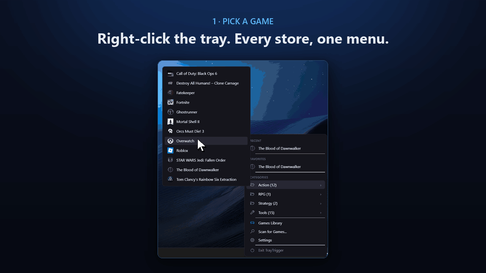
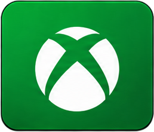
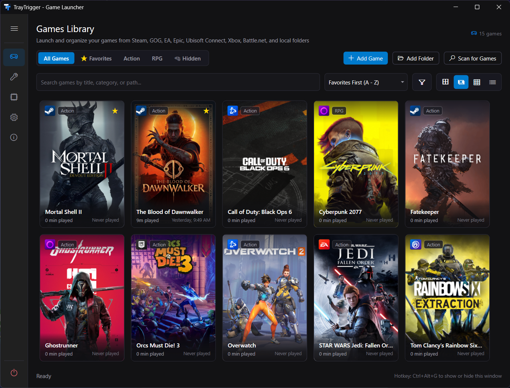
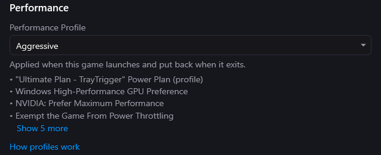
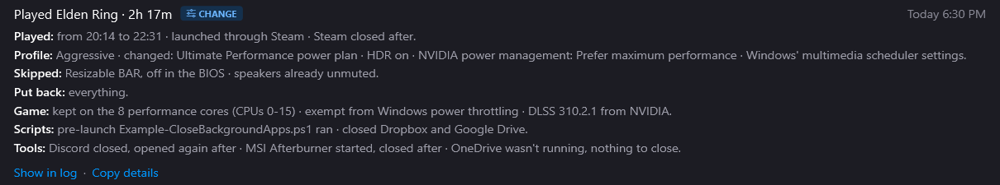

<p align="center">
  
</p>

<h1 align="center">TrayTrigger</h1>

<p align="center">
  
</p>

<p align="center">
  <strong>An open-source game launcher for Windows. Launch from the tray, and let Windows adapt to the game.</strong><br>
  Steam, Epic, GOG, Xbox, Battle.net and more in one tray menu. Each game starts with its own HDR, CPU cores,<br>
  power plan, DLSS and companion apps, with store clients kept out of the way. Quit, and those settings revert.
</p>

<p align="center">
  
</p>

<p align="center">
  
  
  
  
  
</p>

<p align="center">
  <a href="https://github.com/stephenh678/TrayTrigger/releases/latest"><strong>⬇ Download for Windows</strong></a>
  &nbsp;·&nbsp;
  <a href="https://github.com/stephenh678/TrayTrigger/releases/latest">Portable ZIP</a>
  &nbsp;·&nbsp;
  <a href="https://stephenh678.github.io/TrayTrigger/">Website</a>
  &nbsp;·&nbsp;
  <a href="https://github.com/stephenh678/TrayTrigger/wiki">Wiki</a>
  &nbsp;·&nbsp;
  <a href="#faq">FAQ</a>
  &nbsp;·&nbsp;
  <a href="https://github.com/stephenh678/TrayTrigger/discussions">Discussions</a>
</p>

<p align="center">
  Windows 10/11 &nbsp;·&nbsp; Free &nbsp;·&nbsp; Open Source (MIT) &nbsp;·&nbsp; No account &nbsp;·&nbsp; No telemetry
</p>

<p align="center">
  &nbsp;&nbsp;
  &nbsp;&nbsp;
  &nbsp;&nbsp;
  &nbsp;&nbsp;
  &nbsp;&nbsp;
  &nbsp;&nbsp;
  &nbsp;&nbsp;
  
  <br>
  <sub>Scans all seven, plus anything you drop on the window.</sub>
</p>

---

## Find your reason

Start with the one thing you change by hand before every session.

| If you... | TrayTrigger |
|---|---|
| Juggle too many launchers | Puts seven stores in one tray menu. Launchers start minimized and close after the game. [Launchers](https://stephenh678.github.io/TrayTrigger/#launchers) |
| Have a Ryzen X3D or an Intel hybrid CPU | Puts a game on the 3D V-Cache cores or the P-cores, for that game only. No Process Lasso rules. [CPU cores](https://stephenh678.github.io/TrayTrigger/#performance) |
| Play on an HDR or OLED display | Turns HDR on for the game that does it well and off for the one that doesn't. No more Win+Alt+B. [HDR per game](https://stephenh678.github.io/TrayTrigger/#performance) |
| Sim race or fly | Starts SimHub, CrewChief or TrackIR with the game and closes them when you're done. [Companion apps](https://stephenh678.github.io/TrayTrigger/#sim-racing) |
| Want a feature that isn't there | Runs your own PowerShell before and after any game, and says what it did. [Your scripts](https://stephenh678.github.io/TrayTrigger/#scripts) |
| Chase stutter | Runs the usual checklist in one click, and shows every tweak's real state. [Stutter Check](https://stephenh678.github.io/TrayTrigger/#stutter) |

---

## How it works

The launch is the trigger. Pick a game, and everything you chose for it happens around it.

**1. Launch.** Pick a game from the tray menu, the library or its own hotkey. It starts through its store's client, or directly.

<p align="center">
  
</p>

**2. Set up.** TrayTrigger notes how Windows is set, then applies the game's profile: power plan, HDR, GPU preference, CPU cores, DLSS Override. Your tools close or start, and your script runs.

<p align="center">
  
</p>

**3. Play.** TrayTrigger stays a tray icon. Suspend a game with Ctrl+Alt+P for a cutscene you can't pause, or close it from the tray.

**4. Put back.** When the game exits, every per-game setting goes back and is checked. Closed tools return, and the launcher closes if you asked. After a crash, it happens on the next start.

### Every launch, on the record

Each game's Played row in Activity & History lists what the profile changed, what it skipped and why, the cores the game ran on, what your script said it did, and the tools it closed and started.

<p align="center">
  
</p>

### Also in the box

A hardware readout, library backup and restore, batch editing, an NVIDIA DLSS Override per game, and 22 system tweaks that each show Windows' real current state. All of it has a page on the [wiki](https://github.com/stephenh678/TrayTrigger/wiki/Home).

---

## What it changes, and what it doesn't

- **What goes back:** per-game settings go back when the game exits, and are checked. After a crash, they go back on the next start. System tweaks and whatever your scripts do stay until you undo them. Bulk changes can make a System Restore point first.
- **How it touches a game:** CPU cores are set with Windows CPU Sets, not a hard affinity mask. Nothing is injected into a game and no driver is installed. Suspend refuses games with a kernel anti-cheat. TrayTrigger runs as you, and a few machine-wide tweaks ask for UAC.
- **Your privacy:** no telemetry and no account. It goes online for game info and art, for update checks you can turn off, and for services you add your own key to. MIT licensed. Read the source and [SECURITY.md](SECURITY.md).

---

## Quick start

1. **Install.** Run the installer from the [latest release](https://github.com/stephenh678/TrayTrigger/releases/latest), or unzip the portable build anywhere. Windows 10/11, 64-bit; no .NET install needed. See [signing status](#verifying-a-download).
2. **Scan.** Press **Scan for Games** in the library. Drop an executable or shortcut onto the window for anything it doesn't find.
3. **Play.** Right-click the tray icon and pick a game. Leave its profile **Off** to just launch, and add a profile when you want one.

[See how it works](https://stephenh678.github.io/TrayTrigger/#how) · [Give feedback](https://github.com/stephenh678/TrayTrigger/discussions) · [Report a bug](https://github.com/stephenh678/TrayTrigger/issues/new/choose)

**Did your first game launch successfully?** Tell us the game and launcher, and what you would like it to handle next.

---

## Installation

### Installer (recommended)
Download `TrayTrigger-v*-Setup.exe` from the [latest release](https://github.com/stephenh678/TrayTrigger/releases/latest) and run it. Installs per-user, no admin needed. No .NET runtime install required; TrayTrigger ships self-contained.

### Portable
Download the portable `.zip` from the [latest release](https://github.com/stephenh678/TrayTrigger/releases/latest), extract it anywhere, and run `TrayTrigger.exe`. No installation, no registry footprint beyond what you explicitly enable in Settings.

### Updates
TrayTrigger checks GitHub Releases for updates and installs them in one click. Enable *Receive pre-release (beta) updates* in Settings to get beta builds first; leave it off for stable releases only.

Every release ships a `SHA256SUMS.txt`. The in-app updater verifies the installer against it before launching, and refuses to install anything that doesn't match.

### Verifying a download

Releases are **not code-signed**, so Windows SmartScreen may warn the first time you run the installer (**More info** > **Run anyway**). To check a download, compare its hash with the matching line in the release's `SHA256SUMS.txt`:
```powershell
Get-FileHash .\TrayTrigger-v1.6.1-Setup.exe -Algorithm SHA256
```
Releases are built by the public [GitHub Actions workflow](.github/workflows/release.yml), and the checksum file is itself signed. To verify that signature, see [SECURITY.md](SECURITY.md#verifying-a-release).

### Requirements
- Windows 10 (version 1809+) or Windows 11, 64-bit
- No separate .NET install needed

---

## FAQ

**Why do I need this if I already have Steam?**
Steam's job ends when the game is running. TrayTrigger handles what happens around that, for every game from every store, and it still launches Steam games through Steam.

**Does it work alongside other launchers and library apps?**
Yes. TrayTrigger launches each game through its own client and changes nothing about how those clients work. Run whatever front end you like; TrayTrigger manages the session around the launch.

**Is it safe? What does it touch?**
Only the profiles, tweaks, and scripts you enable. Per-game profile settings restore on exit; system-wide tweaks stay applied until reverted. Scripts require their own cleanup actions. Bulk changes can create a System Restore point first. Scripts are off until you enable them and choose one, and they run as you. See [SECURITY.md](SECURITY.md) for the full breakdown.

**Does it need administrator access?**
Not to run. A few tweaks write machine-wide settings (`HKEY_LOCAL_MACHINE`, the Defender exclusion list) and show a UAC prompt when you enable them. TrayTrigger never runs elevated by default.

**Does it phone home?**
No telemetry. Outbound calls are Steam's public API (metadata and artwork for games you add), SteamGridDB and RAWG (only if you enter your own key), NVIDIA's driver service (only when you press Check for Newer Driver on an NVIDIA GPU), and GitHub Releases (update checks, which you can turn off).

**Can changes be reverted?**
Per-game profile settings restore on exit, with recovery on the next start after a crash. System-wide tweaks can be reverted individually or with Undo Preset. Custom scripts are not automatically undone; configure a post-exit script for any cleanup they need.

---

## Wiki

Every tweak, profile option, script feature, and library setting has a page at the [TrayTrigger wiki](https://github.com/stephenh678/TrayTrigger/wiki). It's the same text the app shows under **Learn more**, generated from the same source files, so it's always current.

## Tech Stack

- **Framework**: .NET 10.0 (WPF) with C# 14
- **Tray Icon**: `H.NotifyIcon.Wpf`
- **WMI & Hardware**: `System.Management`
- **Serialization**: `System.Text.Json` Source Generation (`AppJsonContext`)
- **Native Interop**: Modern `[LibraryImport]` P/Invoke (User32, DwmApi)

## Building From Source

### Prerequisites
- Windows 10 (version 1809+) or Windows 11 (64-bit recommended)
- [.NET 10.0 SDK](https://dotnet.microsoft.com/download)

### Build & Run
```bash
git clone https://github.com/stephenh678/TrayTrigger.git
cd TrayTrigger
dotnet build
dotnet run
```

### Self-Contained Single-File Release
```bash
dotnet publish -c Release -r win-x64 --self-contained true
```

See [CONTRIBUTING.md](CONTRIBUTING.md) for running tests and PR guidelines.

## Contributing

Bug reports, feature requests, and pull requests are welcome. See [CONTRIBUTING.md](CONTRIBUTING.md) to get started. Written a launch script worth sharing? Post it in [Show and tell](https://github.com/stephenh678/TrayTrigger/discussions/categories/show-and-tell).

## Security

If you find a security issue, please see [SECURITY.md](SECURITY.md) for how to report it privately.

## License

This project is licensed under the MIT License - see the [LICENSE](LICENSE) file for details.

**Forks and credit.** TrayTrigger is MIT licensed: keep the copyright notice and license text. If you build on it, a link back is appreciated but not required. If you publish your own builds, please use a different name and icon so people can tell them from the official releases, which are only at [github.com/stephenh678/TrayTrigger/releases](https://github.com/stephenh678/TrayTrigger/releases).
